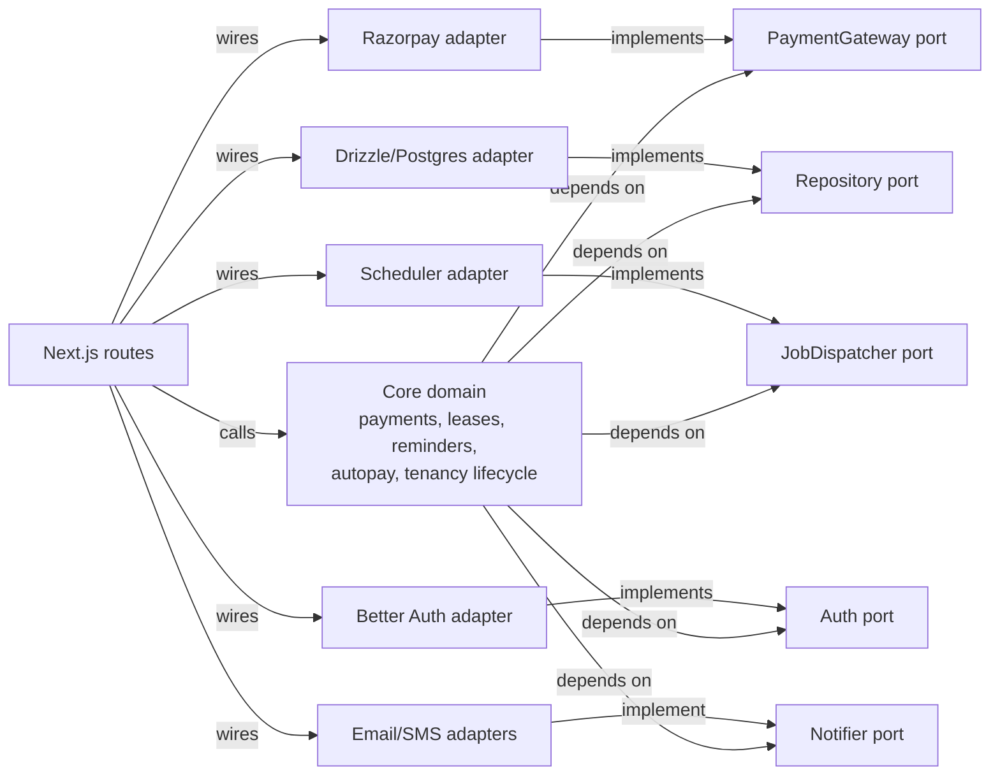
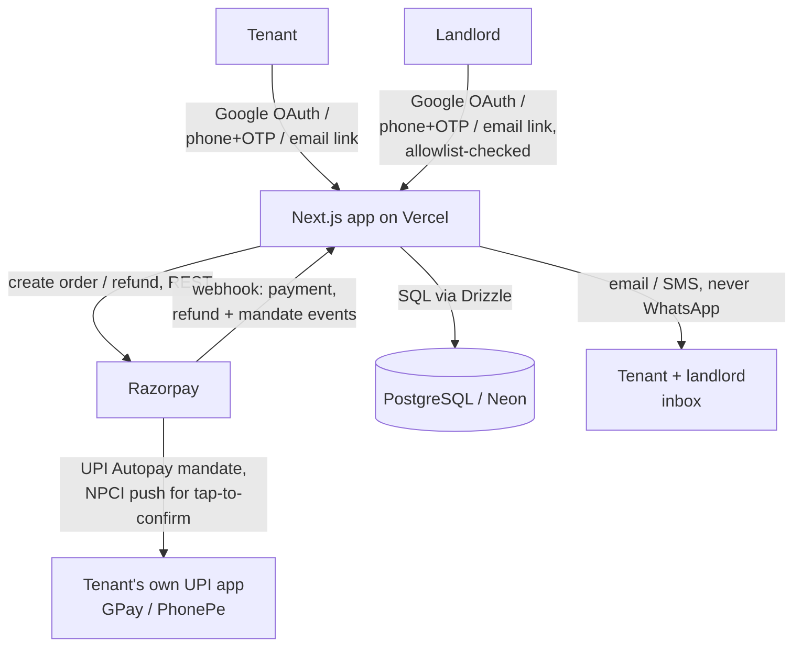
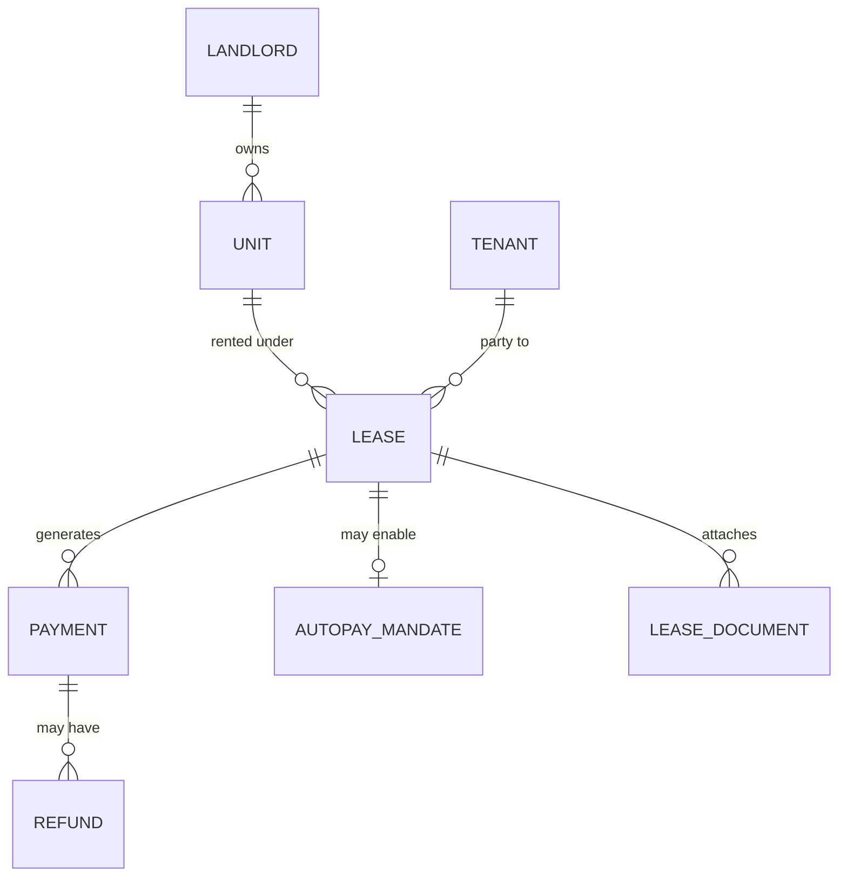

# Architecture Spine — Tenant Portal

## Design Paradigm

Hexagonal (ports-and-adapters). The core domain depends only on port interfaces it defines; every external system — the payment gateway, the database, the job scheduler, auth, outbound messaging — sits behind an adapter implementing one of those ports. This directly serves SPEC.md's locked constraint that the payment module must stay isolated so productizing later means rewriting one layer, not the app.

- `core/` — domain logic (payments, leases, reminders, autopay, tenancy lifecycle). Depends only on `ports/`.
- `ports/` — interfaces the core depends on (`PaymentGateway`, `JobDispatcher`, repository ports, `Auth`, `Notifier`).
- `adapters/` — implementations of those ports (Razorpay, Drizzle/Postgres, the job scheduler, Better Auth, email/SMS). Depend on `ports/` and `core/`'s public types, never the reverse.
- `app/` — Next.js App Router routes. Thin: wires adapters to core, contains no business logic of its own.

## Invariants & Rules

### AD-1 — Dependency direction [ADOPTED]

- **Binds:** all
- **Prevents:** core domain logic becoming entangled with a specific gateway, database, scheduler, auth, or messaging implementation — which would turn swapping any of them (productizing beyond single-landlord use, migrating gateways) into a rewrite instead of a one-adapter change.
- **Rule:** code under `core/` may import only from `ports/` and other `core/` modules. Code under `adapters/` may import `ports/` and `core/`'s public types, never the reverse. `app/` wires adapters to core and holds no business logic. Every port defines a single typed result/error contract for its methods (e.g. a `Result<T, PortError>` shape) — an adapter may not throw or return its own ad-hoc error shape across a port boundary; two adapters implementing the same port must be interchangeable from the core's point of view, including on failure. This rule is a risk-reduction measure, not a correctness necessity — if every port's own contract were followed perfectly, differing conventions per port would still work — but one convention to recall and apply everywhere is a smaller target to miss than several independently-documented ones, especially given fragmented story-by-story dispatch with no shared memory between sessions. `Notifier` calls specifically fire only after their triggering state change has committed successfully — never before, and never inside the same transaction — so CAP-11's three independent trigger points (payments, autopay, identity) can't diverge into notifying about a state change that then rolls back.



### AD-2 — Money-correctness and idempotency [ADOPTED]

- **Binds:** CAP-1, CAP-5, CAP-9, CAP-2 (reminder-suppression logic)
- **Prevents:** a payment or refund being recorded twice from a duplicate webhook delivery, an Autopay mandate firing twice in one cycle, the app's own records silently diverging from what Razorpay actually processed, a refund exceeding what was actually paid, or a tenant being told rent is covered when this cycle's auto-debit actually failed.
- **Rule:** Razorpay is always the system of record for payment, refund, and mandate state. Every webhook handler is idempotent, keyed on Razorpay's event id — a duplicate delivery of the same event (payment or refund) is a no-op. The idempotency check is a durable dedup record (Razorpay event id, checked and written inside the same transaction as the resulting state change) consulted *before* any side effect (notification, reminder cancellation, another API call) runs — relying on a DB unique constraint alone is not sufficient, since a constraint violation caught after a side effect has already fired does not prevent that side effect from duplicating. A refund amount is validated against the original payment's amount *before* the refund API call is made, never checked only after the fact. Reminder suppression checks whether *this cycle's* Autopay auto-debit actually succeeded — never merely whether a mandate exists — so a tenant whose autopay fails for a cycle still gets the reminder. The app reconciles against Razorpay's data rather than trusting only its own locally-computed state.

### AD-3 — Risk-proportional testing and review gate [ADOPTED]

- **Binds:** CAP-1, CAP-5, CAP-9 (heavy gate); all (baseline gate)
- **Prevents:** untested money-handling code reaching production, and — equally — a uniform heavy review process diluting the signal on the changes that actually carry financial risk.
- **Rule:** all code requires passing tests before merge, no exceptions. Code touching payment collection, refunds, webhook handling, or the Autopay mandate additionally requires tests run against Razorpay's own test-mode/sandbox environment — not an arbitrary in-process mock invented per test file — plus a `code-review`/`security-review` pass before shipping, every time, with no small-change exception. A shared test-fixture/harness for the Razorpay sandbox is part of `adapters/razorpay/`, so different contributions can't each invent an inconsistent mocking strategy. Other capabilities get the baseline test-first requirement only.

### AD-4 — Data protection floor [ADOPTED]

- **Binds:** all (any code storing PAN numbers or lease documents)
- **Prevents:** PAN numbers or lease documents being exposed via logs, a public bucket, or an unauthenticated URL.
- **Rule:** PAN numbers are encrypted at rest and never written to any log line, using one designated application-level encryption mechanism and key-management approach (single key/keyring, defined once in `adapters/db/`) — no adapter or future feature (e.g. the deferred TDS work) may introduce a second, incompatible encryption scheme for the same field type. Lease documents and CAP-8's payment-history exports live in access-controlled object storage behind signed, time-expiring URLs — never a public bucket. This is a technical floor only; it does not by itself satisfy the full DPDP Act, 2023 posture (see Deferred).

### AD-5 — Identity resolution across auth methods [ADOPTED]

- **Binds:** CAP-6, CAP-7
- **Prevents:** the same real person ending up with two disconnected accounts because they used a different sign-in method than before. Better Auth's native cross-provider account linking is documented as unreliable — it creates a second, unlinked account by default unless told explicitly that two identities belong together.
- **Rule:** every sign-in method (Google OAuth, phone+OTP, email magic link) authenticates through the `Auth` port purely to prove control of one identifier — nothing more. A separate, application-owned resolution step then matches that identifier against the landlord-recorded phone/email on the tenant record (CAP-6) or the single allowlisted identifier (CAP-7 — no ambiguity, exactly one identity permitted). Every identifier is normalized to one canonical form in a single shared place before any comparison — email case-folded, phone numbers reduced to one canonical format (e.g. E.164) regardless of how a country code was supplied — so two independently-built resolution paths (one per sign-in method) cannot silently fail to match the same real identifier over a formatting difference. An identifier that doesn't match anything on file triggers a one-time confirmation of an already-on-file identifier before linking — the application never silently creates a second account for an existing tenant. No password-based method exists anywhere in this system (SPEC.md non-goal) — resolution logic never needs to reconcile a password with the other methods.

### AD-6 — Tenancy-end revocation and export [ADOPTED]

- **Binds:** CAP-8
- **Prevents:** a former tenant retaining live access via an already-issued session or token after their tenancy ends, because "revoke access" was implemented as only blocking new logins rather than invalidating existing sessions — a common real bug with session/JWT-based auth that doesn't automatically revoke on a disabled flag.
- **Rule:** ending a tenancy immediately invalidates all of that tenant's active sessions (explicit session revocation, checked on every request, not just re-evaluated at next login) and, in the same operation, generates a point-in-time export of their payment history for that tenancy. This requires the `Auth` adapter to use a session strategy capable of live server-side revocation (a stateful/DB-backed session record checked per request) — a stateless, self-contained token re-validated only at its own expiry cannot actually be revoked immediately, so that shape of session is not permitted here regardless of which auth provider is wired in. The export is stored via the same object-storage-behind-signed-URL pattern AD-4 uses for lease documents, and its link is delivered through the `Notifier` port. No ongoing login is ever granted to an ended tenancy — only the one-time export — because a phone number or email freed by offboarding could later be reassigned to someone else, and an ongoing login would let that new person impersonate the former tenant.

## Consistency Conventions

| Concern | Convention |
| --- | --- |
| Naming (entities, files, interfaces, events) | Domain nouns in `core/` and `ports/` (e.g. `PaymentGateway`, `LeaseDocument`); adapters named for what they wrap (`razorpay-payment-gateway.ts`). |
| Data & formats (ids, dates, error shapes, envelopes) | IDs: UUIDv7 (sortable, avoids sequential enumeration of payment/tenant records). Dates/timestamps: ISO-8601 UTC in storage and transit, converted to IST only at display. Errors: a single JSON envelope, `{ error: { code, message } }`. |
| State & cross-cutting (mutation, errors, logging, config, auth) | Structured JSON logging; PAN and full payment credentials are never written to a log line (enforces AD-4). Configuration via environment variables only — no secrets committed to the repo. Both landlord (CAP-7) and tenant (CAP-6) authenticate via the same three passwordless methods, resolved per AD-5 — neither party is exempt from authenticating; there is no no-login path anywhere in this system. |

## Stack

| Name | Version |
| --- | --- |
| TypeScript | 7.0.2 |
| Next.js (App Router) | 16.3.0 |
| React | 19.2 |
| Node.js (Vercel runtime) | 24 |
| Drizzle ORM | 0.45.2 |
| PostgreSQL | 18.6, via Neon (serverless, scale-to-zero compute) |
| Better Auth | 1.6+ (May 2026) |
| Razorpay | REST API + official Node SDK, webhook-driven — no version pin (see Deferred: exact SDK version to confirm at implementation time) |
| Vercel | hosting / deployment platform, scale-to-zero |

## Structural Seed

**System context**



**Core entities**



**Deployment & environments**

Single Vercel project, scale-to-zero serverless functions for `app/api/*` and server-rendered routes; static assets on Vercel's CDN. One Neon Postgres database — serverless compute that scales to zero when idle, same as the app tier, chosen because Vercel Postgres itself was retired and migrated to Neon in Dec 2024, making it the de facto standard pairing. No staging environment for the POC; a `.env.local` / Vercel environment-variable split covers dev vs. production secrets. No load balancer or multi-instance redundancy at this stage (AD-2's idempotency guarantee is what makes that safe to defer — a late-processed webhook after a brief outage still can't double-record).

**Source tree**

```text
resident-portal/
  app/                          # Next.js App Router -- thin, wires adapters to core
    (landlord)/dashboard/       # landlord-facing pages, incl. portfolio aggregate view (CAP-3)
    (tenant)/portal/            # tenant-facing pages -- history, lease docs, pay, autopay (CAP-2/3/4/5)
    invite/[token]/             # tenant invitation activation (CAP-6)
    api/webhooks/razorpay/      # Razorpay webhook receiver (payments, refunds, mandates)
  core/                         # domain logic -- depends only on ports/
    payments/                   # collection + history + refunds (CAP-1, CAP-3, CAP-9)
    leases/                     # lease, renewal, document logic (CAP-4, CAP-10)
    reminders/                  # reminder scheduling + autopay-aware suppression (CAP-2)
    autopay/                    # mandate lifecycle incl. cancel + rent-change sync (CAP-5, CAP-10)
    identity/                   # invitation + identity resolution (CAP-6, CAP-7, AD-5)
    tenancy/                    # end-of-tenancy revocation + export (CAP-8, AD-6)
  ports/                        # interfaces core depends on
    payment-gateway.ts
    job-dispatcher.ts
    repository.ts
    auth.ts
    notifier.ts
  adapters/                     # swappable implementations of ports/
    razorpay/
    db/                         # Drizzle-backed repository + object storage
    scheduler/
    auth/                       # Better Auth wiring, shared by landlord + tenant (AD-5)
    notify/                     # email + SMS adapters (never WhatsApp)
  db/                           # Drizzle schema + migrations
```

## Capability → Architecture Map

| Capability | Lives in | Governed by |
| --- | --- | --- |
| CAP-1 — real payment collection | `core/payments/`, `adapters/razorpay/` | AD-1, AD-2, AD-3 |
| CAP-2 — reminders + portal payment | `core/reminders/`, `(tenant)/portal/` | AD-1, AD-2 |
| CAP-3 — payment history (per-unit, aggregate, tenant view) | `core/payments/` (read side), dashboard + portal | AD-1, AD-2 |
| CAP-4 — lease documents | `core/leases/`, `adapters/db/` (object storage) | AD-1, AD-4 |
| CAP-5 — UPI Autopay mandate + cancellation | `core/autopay/`, `adapters/razorpay/` | AD-1, AD-2, AD-3 |
| CAP-6 — tenant invitation + login | `core/identity/`, `invite/[token]/` | AD-1, AD-5 |
| CAP-7 — landlord setup (allowlisted) | `core/identity/`, `(landlord)/dashboard/` | AD-1, AD-5 |
| CAP-8 — end tenancy, revoke, export | `core/tenancy/` | AD-1, AD-4, AD-6 |
| CAP-9 — refund | `core/payments/`, `adapters/razorpay/` | AD-1, AD-2, AD-3 |
| CAP-10 — renew a lease | `core/leases/`, `core/autopay/` (mandate sync) | AD-1, AD-2 |
| CAP-11 — landlord notifications | `core/payments/`, `core/autopay/`, `core/identity/` (triggers), `adapters/notify/` | AD-1 |

## Deferred

- **Export file format** (CSV, PDF, or JSON for CAP-8's payment-history export) — not architecturally significant; decide at implementation time.
- **Exact Razorpay Node SDK version** — confirm at implementation time against Razorpay's current docs, alongside the UPI Autopay AFA threshold verification SPEC.md already requires.
- **TDS (Sec 194-IB) Tier A calculation** — deferred post-MVP per SPEC.md; will need its own port/adapter thought when it's built (likely a new adapter under `core/payments/`, not a new paradigm).
- **TDS Tier B (auto-filing)** — downgraded to backlog research in SPEC.md; not architected here.
- **Full DPDP Act, 2023 posture** (consent flows, retention/deletion policy, data-subject rights) — bigger than architecture alone should decide; AD-4/AD-6 are a technical floor only. No longer purely abstract: CAP-8/AD-6 now promises both parties a durable record after offboarding, which is in active tension with a future DPDP-based deletion request from either party.
- **Whether a phone/email freed by CAP-8 can be reused for a different (or renewing) tenant's record** — a data-model question. (The security risk of impersonation via a reassigned identifier is already closed by AD-6 — no ongoing login is ever granted.)
- **Whether one lease can have multiple tenants** (e.g. roommates) — unaddressed either way; may not apply given the 1-5 unit individual-flat target segment.
- **Tenant-initiated end-of-tenancy** — CAP-8 is landlord-initiated only; a tenant-requested equivalent is a weak, optional finding from the SPEC.md completeness pass, not yet decided.
- **Landlord KYC/onboarding requirements Razorpay imposes** — open question carried from SPEC.md, unresolved.
- **What defines success beyond the dogfood POC** (e.g., N other landlords onboarded) — open question carried from SPEC.md, unresolved.
- **Java/Kotlin/Python/Go/Rust stacks** — all considered and set aside during coaching (see memlog for full reasoning); Rust specifically ruled out for CAP-1/CAP-5/CAP-9 due to no maintained official Razorpay SDK.
- **React Native / native mobile app, PWA layer** — considered and rejected; no capability requires native capability (Autopay confirmation happens in the tenant's own UPI app). PWA noted as possible future polish only.
- **Cashfree** — considered as the gateway, set aside in favor of Razorpay (no AMC, stronger recurring-billing fit).
- **Multi-instance redundancy / high-availability infrastructure** — deferred until real external adoption happens; a single instance is acceptable for the POC given AD-2's idempotency guarantee.
- **Uniform (non-risk-proportional) review gating** — deliberately rejected in favor of AD-3's risk-proportional gate.
